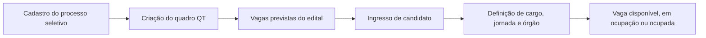

# Controle de Vagas — Temporárias

## Finalidade

O módulo controla vagas de contratos temporários originadas em processos seletivos simplificados (PSS). Ele separa a previsão do edital das vagas que efetivamente surgem ao longo dos ingressos, especialmente quando há cadastro reserva.

## Conceitos

| Conceito | Significado |
| --- | --- |
| Processo seletivo | Origem legal e operacional do quadro temporário. Deve ser um PSS com vínculo temporário. |
| Quadro temporário | Registro que reúne as vagas derivadas de um único processo seletivo. Usa código `QT-00001`. |
| Vaga prevista | Quantidade indicada para o processo seletivo ou seus cargos no edital. |
| Cadastro reserva (CR) | Possibilidade de chamar candidatos além da quantidade originalmente prevista. Não cria vagas ilimitadas antecipadamente. |
| Vaga real | Vaga individualizada e efetivamente criada. Pode ultrapassar a previsão quando houver CR. |
| Ingresso | Processo que define cargo, jornada e órgão de destino da vaga. |

## Fluxo do módulo

1. Um processo seletivo simplificado é cadastrado no Controle de Certame.
2. O usuário cria um Quadro Temporário para esse processo seletivo.
3. O quadro recebe os cargos, quantitativos previstos e regras de cadastro reserva do seletivo como referência.
4. As vagas são consultadas em Vagas Contratos Temporários.
5. O ingresso associa uma vaga a um candidato e define cargo, jornada e órgão de destino.
6. A vaga acompanha o ciclo de disponibilidade, ingresso e ocupação.

## Regras para criação do quadro

- Somente PSS com vínculo temporário pode originar quadro temporário.
- Um processo seletivo pode impactar um ou mais cargos.
- Um processo seletivo pode possuir apenas um quadro temporário.
- O processo seletivo usado aparece indisponível para um novo cadastro.
- O quadro recebe código sequencial no padrão `QT-00001`.
- A data de início deve ser atual ou passada; datas futuras não são aceitas.
- Todo quadro novo inicia com situação **Ativo**.

### Dados recebidos do processo seletivo

O quadro registra uma cópia do processo seletivo e de seus cargos para preservar a referência do edital:

- identificação do processo e do edital;
- órgão responsável pelo processo seletivo;
- tipo de vínculo, regime jurídico, publicação e validade;
- cargos previstos no edital;
- quantidade prevista por cargo;
- indicação e quantidade de cadastro reserva;
- jornada, polo, municípios e cotas cadastrados no processo.

Esses dados servem de referência do edital. Eles não definem automaticamente os dados operacionais de cada vaga individualizada.

## Cadastro reserva e quantitativos

| Cenário | Regra |
| --- | --- |
| 40 vagas sem CR | O quadro tem limite de 40 vagas reais. |
| 40 vagas com CR | O edital prevê 40 vagas, mas o quadro pode gerar mais vagas reais conforme novos ingressos. |

O sistema não pré-cria vagas infinitas. A indicação `40 + CR` informa que há previsão inicial de 40 vagas e possibilidade de novas chamadas.

## Quadro Contratos Temporários

Rota: `/prototipos/sigep/controle-vagas/temporarios/quadro-autorizado`

### Indicadores

| Indicador | Regra |
| --- | --- |
| Processos seletivos cadastrados | Total de PSS temporários cadastrados no sistema. |
| Quadros temporários criados | Total de quadros QT criados. |
| Cargos com vagas temporárias | Total de cargos habilitados para o controle de vagas temporárias. |
| Vagas temporárias previstas | Soma das vagas indicadas nos editais dos quadros. |
| Vagas temporárias reais | Total de vagas reais geradas; pode superar a previsão em quadros com CR. |

### Filtros

- Quadro: pesquisa por código, edital ou número.
- Cargo: localiza quadros cujos processos seletivos possuam o cargo de referência.
- Órgão: órgão responsável pelo processo seletivo.
- Situação: Ativo, Extinto ou Encerrado.

### Colunas

| Coluna | Conteúdo |
| --- | --- |
| Quadro | Código QT e referência do processo seletivo. |
| Processo seletivo | Nome e situação do PSS. |
| Órgão responsável | Órgão responsável pelo processo seletivo. |
| Vigência | Data de início do quadro. |
| Cargos | Quantidade de cargos de referência no PSS; o número abre o modal com a relação de cargos. |
| Vagas previstas | Soma do edital, com `+ CR` quando houver cadastro reserva. |
| Situação | Ativo, Extinto ou Encerrado. |
| Ações | Visualizar o resumo do quadro. |

## Vagas Contratos Temporários

Rota: `/prototipos/sigep/controle-vagas/temporarios/vagas`

A consulta exige a seleção de um quadro. Sem seleção, a tabela não exibe vagas e mostra a mensagem orientando a escolha do quadro.

### Indicadores gerais

A primeira linha exibe processos seletivos cadastrados, quadros temporários criados, cargos com vagas temporárias e vagas temporárias previstas.

### Indicadores do quadro selecionado

| Indicador | Regra |
| --- | --- |
| Vagas temporárias reais | Vagas individualizadas existentes para o quadro. |
| Vagas disponíveis | Vagas sem ingresso ou ocupante. |
| Vagas em ocupação | Vagas reservadas por ingresso em andamento. |
| Vagas ocupadas | Vagas preenchidas após a conclusão do ingresso. |

### Filtros

- Quadro Contratos Temporários;
- Órgão de destino;
- Nome da vaga;
- Ocupante atual;
- Ingresso/ocupação;
- Situação legal.

Cargo não é um dado inicial da vaga. Quando houver integração de ingresso, o filtro de cargo deve usar o cargo efetivamente definido naquele ingresso.

### Dados da vaga

A vaga recebe identificador sequencial como `QT-00001-001`. Antes do ingresso, apresenta:

- cargo: não definido;
- jornada: não definida;
- órgão de destino: não definido;
- ocupante: sem ocupante atual;
- situação de ocupação: disponível;
- situação legal: ativa.

O ingresso é responsável por definir cargo, jornada e órgão de destino, escolhendo um dos cargos previstos no processo seletivo.

## Situações

### Situação de ocupação

| Situação | Significado |
| --- | --- |
| Disponível | Vaga pronta para receber ingresso. |
| Em ocupação | Vaga reservada por processo de ingresso ainda em andamento. |
| Ocupada | Vaga preenchida por contratado temporário. |

### Situação legal

| Situação | Significado |
| --- | --- |
| Ativa | Quadro e vaga podem receber novos ingressos. |
| Extinta | Não admite novos ingressos; dados e ocupações anteriores são preservados. |
| Encerrada | Sem operação ativa; permanece disponível apenas para histórico. |

## Versionamento proposto

O versionamento ainda será implementado. A proposta é manter o código QT e criar novas versões para retificação de edital, atualização de base legal, alteração de vigência, extinção ou encerramento.

A versão inicial será **Versão 1 — Criação**. Cada alteração deverá registrar documento legal, processo administrativo, data de efeito atual ou passada e justificativa. O histórico não pode ser sobrescrito.

## Persistência do protótipo

Os quadros temporários são salvos no armazenamento local do navegador, na chave `sigep:quadros-temporarios:cadastros:v1`. Eles permanecem após atualizar a página no mesmo navegador.

A persistência definitiva requer API, banco de dados, auditoria e integrações com Controle de Certame e Ingresso.

## Padrão visual

As telas seguem o padrão definido em `docs/controle-vagas.md`: breadcrumb, cabeçalho, KPIs, filtros, listagem e formulários em cartões independentes.
